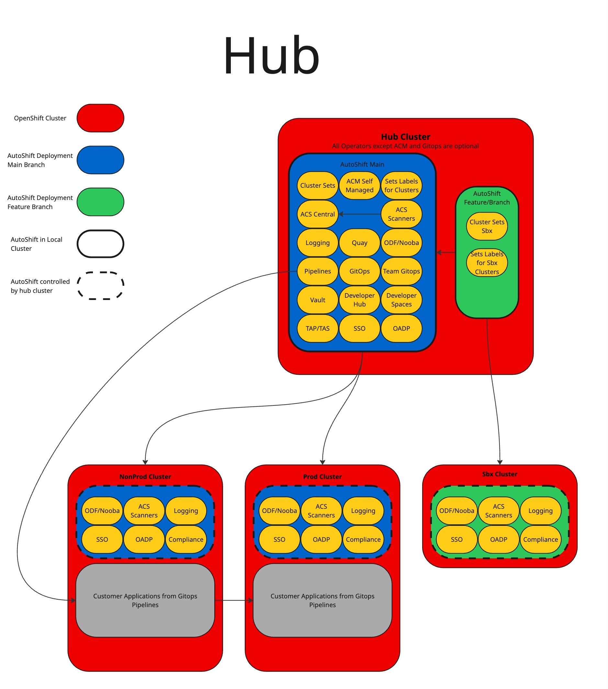
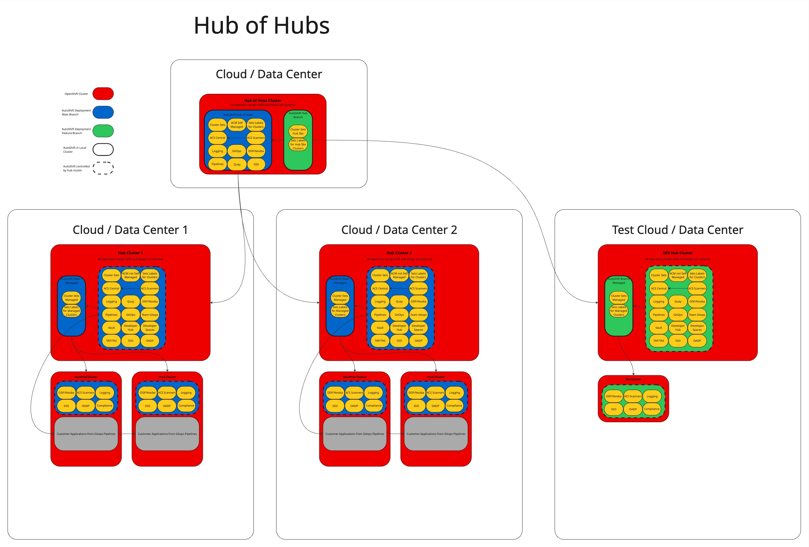
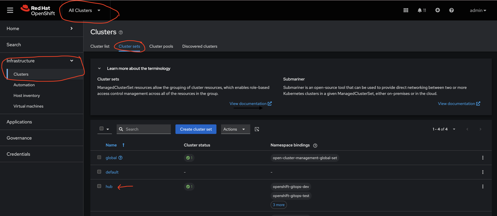
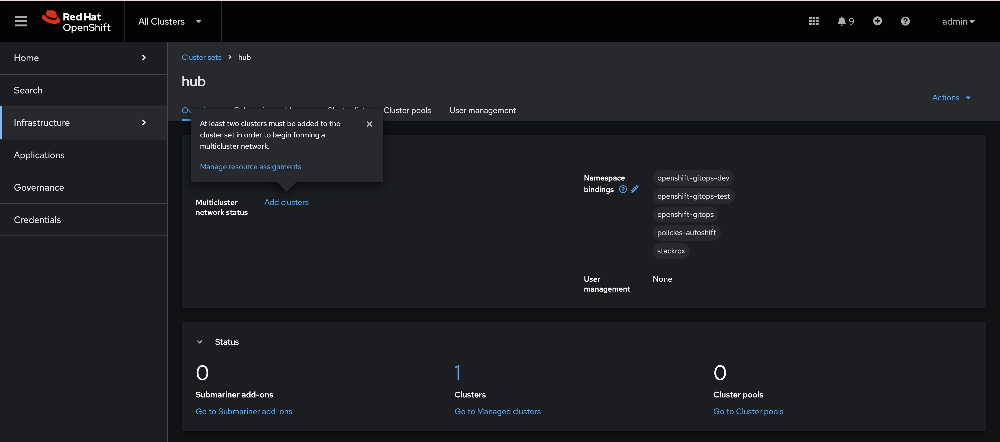

# AutoShiftv2

## Hub Architecture


## Hub of Hubs Architecture


## How To Install

Fork, clone, or use upstream git repo

install [helm](https://helm.sh/docs/intro/install/) on local machine

install oc from hub cluster

login to hub cluster as cluster-admin
```
oc login
```

Update apps/day-1/openshift-gitops/values.yaml and apps/day-1/advanced-cluster-management/values.yaml with desired source mirror registry for disconnected or leave as is for connected


If your clone of AutoShiftv2 requires credentials or you would like to add credentials to any other git repos you can do this in the openshift-gitops/values file before installing. This can also be done in the OpenShift GitOps GUI after install.

Install OpenShift GitOps
```
helm upgrade --install openshift-gitops openshift-gitops -f apps/day-1/openshift-gitops/values.yaml
```
Note: If OpenShift GitOps is already installed manually on cluster and the default argo instance exists this step can be skipped. Make sure that argocd controller has cluster-admin

Test if OpenShift GitOps was installed correctly
```
oc get argocd -A
```
This command should return something like this:
```
NAMESPACE          NAME               AGE
openshift-gitops   openshift-gitops   29s
```

If this is not the case you may need to run helm upgrade again.

Install Advanced Cluster Management
```
helm upgrade --install advanced-cluster-management advanced-cluster-management -f apps/day-1/advanced-cluster-management/values.yaml
```

Test Advanced Cluster Management
```
oc get mch -A -w
```

This should look like this:
```
NAMESPACE                 NAME              STATUS       AGE     CURRENTVERSION   DESIREDVERSION
open-cluster-management   multiclusterhub   Installing   2m35s                    2.13.2
open-cluster-management   multiclusterhub   Installing   2m39s                    2.13.2
open-cluster-management   multiclusterhub   Installing   3m12s                    2.13.2
open-cluster-management   multiclusterhub   Installing   3m41s                    2.13.2
open-cluster-management   multiclusterhub   Installing   4m11s                    2.13.2
open-cluster-management   multiclusterhub   Installing   4m57s                    2.13.2
open-cluster-management   multiclusterhub   Installing   5m15s                    2.13.2
open-cluster-management   multiclusterhub   Installing   5m51s                    2.13.2
open-cluster-management   multiclusterhub   Running      6m28s   2.13.2           2.13.2
```

Note: this does take roughly 6 min to install. You can proceed to installing AutoShift while this is installing but you will not be able to verify AutoShift or select a clusterset until this is finished.


Both ACM and GitOps will be controlled by autoshift after it is installed for version upgrading

Update autoshift/values.yaml with desired feature flags and repo url

Install AutoShiftv2

example using the hub values file
```
helm template autoshift autoshift -f autoshift/values.hub.yaml | oc apply -f -
```

Given the labels and cluster sets provided in the values file, ACM cluster sets will be created.

Go to cluster sets in the acm console


Manually select which cluster will belong to each cluster set, or when provisioning a new cluster from ACM you can select the desired cluster set from ACM at time of creation.


That's it. Welcome to OpenShift Platform Plus!

## Cluster Labels
#### values can be set on a per cluster and clusterset level to decide what features of autoshift will be applied to each cluster. If a value is defined in helm values, a clusterset label and a cluster 
#### label precedence will be cluster -> clusterset -> helm values where helm values is the least. Helm values are meant to be defaults.
##

### Advanced Cluster Manager
Hub Clusters Only

self-managed: true or false

acm-channel: default release-2.13

acm-install-plan-approval: default Automatic

acm-source: default redhat-operators

acm-source-namespace: default openshift-marketplace

acm-availability-config: supports basic or high

### OpenShift Gitops

gitops-channel: default latest

gitops-install-plan-approval: default Automatic

gitops-source: default redhat-operators

gitops-source-namespace: default openshift-marketplace

### Infra Nodes
infra-nodes<int>: Number of infra nodes min if autoscale. If not set infra nodes are not managed, if blank infra nodes will be deleted

infra-nodes-numcpu<int>: Number of cpu per infra node

infra-nodes-memory-mib<int>: Memory mib per infra node

infra-nodes-numcores-per-socket<int>: Number of CPU Cores per socket

infra-nodes-zones<list<String>>: list of availability zones

### Worker Nodes
worker-nodes<int>: Number of worker nodes min if autoscale. If not set worker nodes are not managed, if blank worker nodes will be deleted

worker-nodes-numcpu<int>: Number of cpu per worker node

worker-nodes-memory-mib<int>: Memory mib per worker node

worker-nodes-numcores-per-socket<int>: Number of CPU Cores per socket

worker-nodes-zones<list<String>>: list of availability zones

### Storage Nodes
storage-nodes<int>: Number of storage nodes min if autoscale. If not set storage nodes are not managed, if blank storage nodes will be deleted. Local Storage Operator will be installed if Storage Nodes are enabled

storage-nodes-numcpu<int>: Number of cpu per storage node

storage-nodes-memory-mib<int>: Memory mib per storage node

storage-nodes-numcores-per-socket<int>: Number of CPU Cores per socket

storage-nodes-zones<list<String>>: list of availability zones

### Advanced Cluster Security
acs<bool>: If not set Advanced Cluster Security will not be managed

acs-channel<String>: default stable

acs-install-plan-approval<String>: default Automatic

acs-source<String>: default redhat-operators

acs-source-namespace<String>: default openshift-marketplace

### Developer Spaces
dev-spaces<bool>: If not set Developer Spaces will not be managed

dev-spaces-channel<String>: default stable

dev-spaces-install-plan-approval<String>: default Automatic

dev-spaces-source<String>: default redhat-operators

dev-spaces-source-namespace<String>: default openshift-marketplace

### Developer Hub
dev-hub<bool>: If not set Developer Hub will not be managed

dev-hub-channel<String>: default fast

dev-hub-install-plan-approval<String>: default Automatic

dev-hub-source<String>: default redhat-operators

dev-hub-source-namespace<String>: default openshift-marketplace

### OpenShift Pipelines
pipelines<bool>: If not set OpenShift Pipelines will not be managed

pipelines-channel<String>: default latest

pipelines-install-plan-approval<String>: default Automatic

pipelines-source<String>: default redhat-operators

pipelines-source-namespace<String>: default openshift-marketplace

### Trusted Artifact Signer
tas<bool>: If not set Trusted Artifact Signer will not be managed

tas-channel<String>: default latest

tas-install-plan-approval<String>: default Automatic

tas-source<String>: default redhat-operators

tas-source-namespace<String>: default openshift-marketplace

### Quay
quay<bool>: If not set Quay will not be managed

quay-channel<String>: default stable-3.13

quay-install-plan-approval<String>: default Automatic

quay-source<String>: default redhat-operators

quay-source-namespace<String>: default openshift-marketplace

### Developer OpenShift Gitops
gitops-dev<bool>: If not set Developer OpenShift Gitops intances will not be managed

gitops-dev-team-{INSERT_TEAM_NAME}<String>: Team that can deploy onto cluster from dev team gitops. Must match a team in the gitops-dev helm chart values file.

### Loki
loki<bool>: If not set Loki will not be managed. Dependent on ODF Multi Object Gateway

loki-channel<String>: default stable-6.2

loki-install-plan-approval<String>: default Automatic

loki-source<String>: default redhat-operators

loki-source-namespace<String>: default openshift-marketplace

loki-size<String>: default 1x.extra-small

loki-storageclass<String>: default gp3-csi

loki-lokistack-name<String>: default logging-lokistack

### OpenShift Logging
logging<bool>: If not set OpenShift Logging will not be managed, Dependent on Loki and COO

logging-channel<String>: default stable-6.2

logging-install-plan-approval<String>: default Automatic

logging-source<String>: default redhat-operators

logging-source-namespace<String>: default openshift-marketplace

### Cluster Observability Operator
coo<bool>: If not set Cluster Observability Operator will not be managed

coo-channel<String>: default stable

coo-install-plan-approval<String>: default Automatic

coo-source<String>: default redhat-operators

coo-source-namespace<String>: default openshift-marketplace

### Compliance Operator Stig Apply
compliance<bool>: If not set Compliance Operator will not be managed. Helm chart config map must be set with profiles and remediations

compliance-name<String>: default compliance-operator

compliance-install-plan-approval<String>: default Automatic

compliance-source<String>: default redhat-operators

compliance-source-namespace<String>: default openshift-marketplace

compliance-channel<String>: default stable

### Local Storage Operator

local-storage<bool>: if not set to true, local storage will not be managed or deployed.

local-storage-channel<String>: 

local-storage-source<String>: 

local-storage-source-namespace<String>: 

local-storage-install-plan-approval<String>: 

### OpenShift Data Foundation
odf<bool>: If not set OpenShift Data Foundation will not be managed. if Storage Nodes are enable will deploy ODF on local storage/ storage nodes

odf-multi-cloud-gateway<String>: values standalone or standard. Install ODF with only nooba object gateway or full odf

odf-nooba-pvpool<bool>: if not set nooba will be deployed with default settings. Recomended don't set for cloud providers. Use pv pool for storage

odf-nooba-store-size<String>: example 500Gi. if pvpool set. Size of nooba backing store

odf-nooba-store-num-volumes<String>: example 1. if pvpool set. number of volumes

odf-ocs-storage-class-name<String>: if not using local-storage, storage class to use for ocs

odf-ocs-storage-size<String>: storage size per nvme

odf-ocs-storage-count<String>: number of replica sets of nvme drives, note total amount will count * replicas

odf-ocs-storage-replicas<String>: replicas, 3 is recommended

odf-resource-profile<String>: default balanced. lean: suitable for clusters with limited resources, balanced: suitable for most use cases, performance: suitable for clusters with high amount of resources.

odf-channel<String>: default stable-4.17

odf-install-plan-approval<String>: default Automatic

odf-source<String>: default redhat-operators

odf-source-namespace<String>: default openshift-marketplace
